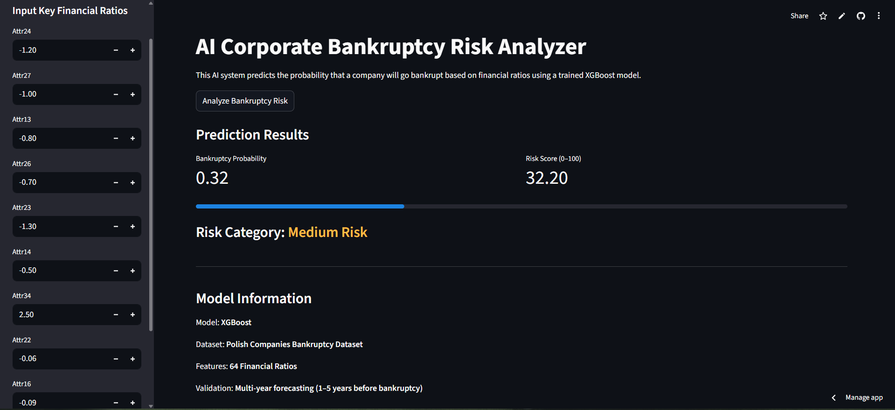

# AI Corporate Bankruptcy Risk Analyzer

AI-powered system that predicts the probability of corporate bankruptcy using financial ratios and machine learning.

The application analyzes financial indicators and estimates bankruptcy risk using an **XGBoost model trained on the Polish Companies Bankruptcy Dataset.**

The project demonstrates how machine learning can detect **financial distress signals several years before bankruptcy occurs.**

---

## Dashboard Preview



---

## Live Application

🔗 **Try the live app here:**
[Streamlit App](https://ai-bankruptcy-risk-analyzer-azim.streamlit.app/)

---

## Problem Statement

Corporate bankruptcy prediction is an important task in **financial risk management.**

Financial institutions, investors, and regulators use predictive models to identify companies at risk of failure.

Early detection of financial distress helps organizations:
- reduce credit risk
- avoid bad investments
- manage financial exposure

This project builds an **AI system capable of predicting bankruptcy risk using financial ratios.**

---

## Dataset

**Polish Companies Bankruptcy Dataset**

Source: UCI Machine Learning Repository

| Property | Value |
|---|---|
| Companies | 7,027 |
| Features used | 63 Financial Ratios (Attr37 excluded — high missingness) |
| Target | Bankruptcy (0 = Survived, 1 = Bankrupt) |
| Class imbalance | ~96% survived, ~4% bankrupt — handled via `scale_pos_weight` |

The dataset includes financial data from companies **1–5 years before bankruptcy**, enabling multi-year prediction analysis.

---

## Machine Learning Pipeline

**Data Preprocessing**
- Dropped `Attr37` due to high proportion of missing values
- Remaining missing values filled with column medians
- Class imbalance handled via `scale_pos_weight` in XGBoost

**Model Training**

Three models were evaluated:

| Model | ROC-AUC |
|---|---|
| Logistic Regression | ~0.83 |
| Random Forest | ~0.93 |
| **XGBoost** | **0.97** ✅ |

XGBoost was selected for deployment.

**Median Imputation (deployment)**

For partial inputs in the app (Quick mode), unset features are imputed with their **training-set median** rather than 0. Defaulting to 0 would falsely signal distress (e.g. zero profit margin, zero equity) for features the user simply left blank.

---

## Model Performance

**1-Year Prediction (Test Set)**

| Metric | Score |
|---|---|
| ROC-AUC | 0.97 |
| Accuracy | 0.99 |

---

## Multi-Year Bankruptcy Forecasting

The model was validated on financial data from **2–5 years before bankruptcy.**

| Prediction Horizon | ROC-AUC |
|---|---|
| 1 Year before bankruptcy | 0.97 |
| 2 Years before bankruptcy | 0.88 |
| 3 Years before bankruptcy | 0.85 |
| 4 Years before bankruptcy | 0.87 |
| 5 Years before bankruptcy | 0.89 |

Financial distress can be detected **up to 5 years before bankruptcy occurs.**

---

## Top Predictive Financial Ratios

The model's most important features (by XGBoost feature importance):

| Rank | Feature | Financial Ratio |
|---|---|---|
| 1 | Attr24 | 3-Year Gross Profit / Total Assets |
| 2 | Attr27 | Operating Profit / Financial Expenses (Interest Cover) |
| 3 | Attr13 | (Gross Profit + Depreciation) / Sales |
| 4 | Attr26 | (Net Profit + Depreciation) / Total Liabilities |
| 5 | Attr23 | Net Profit Margin (Net Profit / Sales) |
| 6 | Attr14 | (Gross Profit + Interest) / Total Assets |
| 7 | Attr34 | Operating Expenses / Total Liabilities |
| 8 | Attr22 | Operating Profit / Total Assets |
| 9 | Attr16 | (Gross Profit + Depreciation) / Total Liabilities |
| 10 | Attr21 | Sales Growth (YoY) |

These ratios relate to **profitability, leverage, and liquidity** — the same dimensions used in the classic Altman Z-Score.

---

## Application Features

- **Quick mode** — enter only the top 10 key ratios (unset features imputed with training medians)
- **Full mode** — all 63 ratios organized into 4 tabs: Profitability, Liquidity, Leverage, Efficiency
- **Gauge chart** — visual risk score with color-coded zones (green / amber / red)
- **Risk category** — Low / Medium / High with contextual advice
- **Multi-year accuracy chart** — shows model ROC-AUC across 1–5 year forecast horizons
- **Tooltips** — every ratio has a plain-English explanation

Risk categories:

| Score | Risk Level |
|---|---|
| 0–30 | 🟢 Low Risk |
| 30–60 | 🟠 Medium Risk |
| 60–100 | 🔴 High Risk |

---

## Tech Stack

| Layer | Tools |
|---|---|
| Language | Python 3 |
| ML | XGBoost, Scikit-learn |
| Explainability | SHAP |
| App | Streamlit |
| Visualisation | Plotly |
| Data | Pandas, NumPy |
| Deployment | Streamlit Cloud |

---

## Model Files

```
model/
├── bankruptcy_xgb_model.pkl   # Trained XGBoost model
├── bankruptcy_features.pkl    # Ordered list of 63 feature names
└── feature_medians.pkl        # Training-set medians for imputation
```

---

## How to Run Locally

```bash
git clone https://github.com/Azim521/AI-Bankruptcy-Risk-Analyzer.git
cd AI-Bankruptcy-Risk-Analyzer
pip install -r requirements.txt
streamlit run app.py
```

---

## Sample Test Values (Quick Mode)

To try the app without real company data, these values represent a **financially distressed** company:

| Ratio | Value |
|---|---|
| 3-Year Gross Profit / Total Assets (Attr24) | -0.05 |
| Interest Cover — Op. Profit / Fin. Expenses (Attr27) | 0.3 |
| (Gross Profit + Depreciation) / Sales (Attr13) | 0.02 |
| (Net Profit + Depreciation) / Total Liabilities (Attr26) | -0.02 |
| Net Profit Margin (Attr23) | -0.08 |

And a **healthy** company:

| Ratio | Value |
|---|---|
| 3-Year Gross Profit / Total Assets (Attr24) | 0.12 |
| Interest Cover — Op. Profit / Fin. Expenses (Attr27) | 4.5 |
| (Gross Profit + Depreciation) / Sales (Attr13) | 0.18 |
| (Net Profit + Depreciation) / Total Liabilities (Attr26) | 0.15 |
| Net Profit Margin (Attr23) | 0.09 |

---

## Author

**Azim Sadath**
Aspiring Data Scientist focused on financial analytics and machine learning systems.
