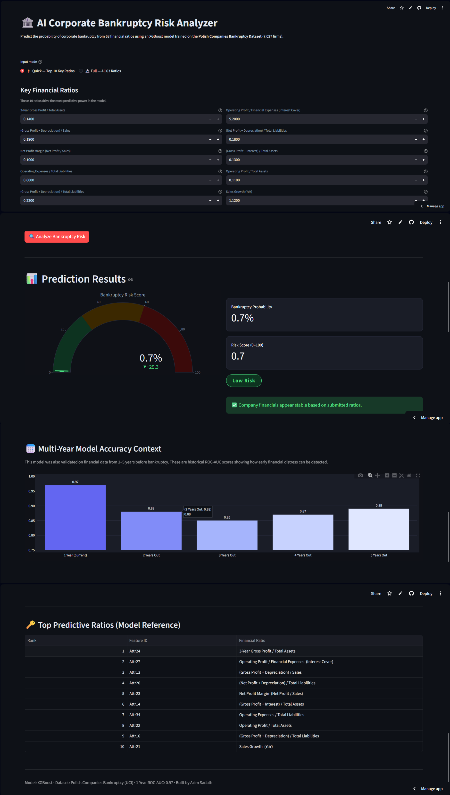

# 🏢 AI Corporate Bankruptcy Risk Analyzer

> Predict the probability of corporate bankruptcy **years before it happens** — using real financial ratios, XGBoost, and SHAP explainability.

[](https://ai-bankruptcy-risk-analyzer-azim.streamlit.app/)


---

## 🚀 Live Demo

👉 **[ai-bankruptcy-risk-analyzer-azim.streamlit.app](https://ai-bankruptcy-risk-analyzer-azim.streamlit.app/)**

---

## 📸 App Preview



---

## ✨ What Makes This Different

| Typical bankruptcy model | This project |
|---|---|
| Predicts only 1 year ahead | Forecasts **1–5 years** before bankruptcy |
| Generic features | Real financial ratios (profitability, leverage, liquidity) |
| Binary output only | Risk score (0–100) + risk category |
| No explainability | SHAP identifies key distress signals |
| Academic only | Deployed live Streamlit app |

---

## 📌 Overview

Built on the **Polish Companies Bankruptcy Dataset** (7,027 companies, 64 financial ratios), this system:

- Predicts bankruptcy with **97% ROC-AUC** (1-year horizon)
- Detects financial distress signals **up to 5 years in advance**
- Uses **SHAP** to identify which financial ratios are driving risk
- Converts predictions into an interpretable **0–100 risk score**
- Deployed as an interactive Streamlit dashboard with grouped tabbed inputs

---

## 📊 Multi-Year Forecasting Performance

This is the core differentiator — the model can detect financial distress signals **years before bankruptcy occurs.**

| Prediction Horizon | ROC-AUC |
|---|---|
| 1 Year before bankruptcy | **0.97** |
| 2 Years before bankruptcy | 0.88 |
| 3 Years before bankruptcy | 0.85 |
| 4 Years before bankruptcy | 0.87 |
| 5 Years before bankruptcy | 0.89 |

---

## 🗃️ Dataset

| Property | Value |
|---|---|
| Source | Polish Companies Bankruptcy Dataset (UCI / Kaggle) |
| Companies | 7,027 |
| Features | 64 Financial Ratios |
| Target | Bankruptcy (0 = Survived, 1 = Bankrupt) |
| Prediction horizons | 1–5 years before bankruptcy |

---

## 🔑 Key Financial Indicators (SHAP Top Features)

Top financial ratios identified by SHAP as the strongest bankruptcy predictors in this model — mapped to their official definitions:

| Feature | Financial Ratio | Category |
| --- | --- | --- |
| Attr24 | Gross profit (3-year avg) / total assets | Profitability |
| Attr27 | Profit on operating activities / financial expenses | Debt Coverage |
| Attr13 | (Gross profit + depreciation) / sales | Cash Flow Margin |
| Attr26 | (Net profit + depreciation) / total liabilities | Cash Flow Coverage |
| Attr23 | Net profit / sales | Net Profit Margin |
| Attr14 | (Gross profit + interest) / total assets | Interest-Adjusted Profitability |
| Attr34 | Operating expenses / total liabilities | Operating Expense Leverage |
| Attr22 | Profit on operating activities / total assets | Return on Assets (Operating) |
| Attr16 | (Gross profit + depreciation) / total liabilities | Cash Flow Solvency |
| Attr21 | Sales(n) / Sales(n-1) | Revenue Growth Rate |

These ratios cover the same financial dimensions used in classical distress models like the **Altman Z-Score** — profitability, solvency, leverage, and growth — validating the model's financial interpretability.

---
## 🏗️ ML Pipeline

```
Polish Companies Dataset (1–5 year horizons)
        ↓
  Data Preprocessing  →  Missing value handling + feature selection
        ↓
  Model Comparison  →  Logistic Regression / Random Forest / XGBoost
        ↓
  XGBoost Selected  →  Best ROC-AUC across all horizons
        ↓
  SHAP Explainability  →  Feature importance per prediction
        ↓
  Risk Scoring  →  0–100 scale with Low / Medium / High categories
        ↓
  Streamlit App  →  Interactive financial ratio inputs + dashboard
```

---

## 🛠️ Tech Stack

| Layer | Technology |
|---|---|
| Model | XGBoost |
| Explainability | SHAP |
| Visualization | Plotly (gauge charts) |
| Frontend | Streamlit |
| Data Processing | Pandas, NumPy, Scikit-learn |

---

## 💻 Run Locally

```bash
# 1. Clone the repo
git clone https://github.com/Azim521/AI-Bankruptcy-Risk-Analyzer.git
cd AI-Bankruptcy-Risk-Analyzer

# 2. Install dependencies
pip install -r requirements.txt

# 3. Run the app
streamlit run app.py
```

---

## 📁 Project Structure

```
AI-Bankruptcy-Risk-Analyzer/
├── app.py                  ← Streamlit dashboard
├── requirements.txt        ← Dependencies
├── Dashboard.png           ← App preview
└── model/
    ├── xgb_model.pkl       ← Trained XGBoost model
    └── scaler.pkl          ← Feature scaler
```

---

## 🔮 Future Improvements

- CSV upload for automated ratio calculation from financial statements
- SHAP explainability dashboard with interactive plots
- Integration with financial data APIs (Yahoo Finance, Alpha Vantage)
- Peer company benchmarking

---

## 📬 Contact

Built by **Azim Sadath**

[](https://www.linkedin.com/in/azim-sadath-a3ba34321/)
[](https://github.com/Azim521)
[](mailto:azimsadath521@gmail.com)
